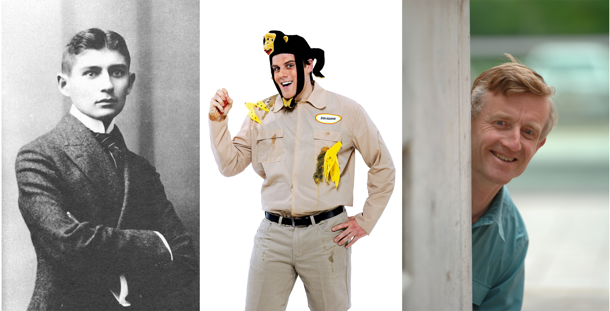

name: inverse
layout: true
class: center, middle, inverse

---

template: inverse

# Hailstorm

## Distributed stream processing with exactly-once semantics

Thomas Dimson & Milind Ganjoo

---

layout: false

# A Guessing Game

.center[.full-width-image[]]

.center.medium[ What do these have in common?]

---

layout: false

# Outline

1. Introduction
2. Background
3. Architecture
4. Topologies
5. Demo

---

# Introduction

---

layout: true

# Background

---

## Storm

* Some
* Stuff
* Here

---

## Kafka

---

layout: false

# Architecture

---

template: inverse

# Demo

---

layout: false

# Info about using remarks.js

<!-- TODO: delele -->

Any occurences of one or more dotted CSS class names followed by square brackets are replaced with the contents of the brackets with the specified classes applied:

Pressing __P__ will toggle presenter mode.

Pressing __C__ will open a cloned view of the current slideshow in a new
browser window.

.footnote[.red.bold[*] Footnote here]

???

Slide notes here...

- More notes.
- Some more notes.

---

# Code sample (defaults to Haskell)

```
doSomething :: String -> IO ()
doSomething s = putStrLn $ "hello, " ++ show s
```
