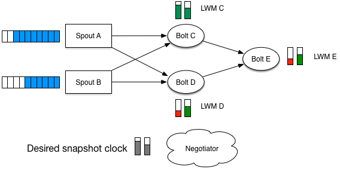

name: inverse
layout: true
class: center, middle, inverse

---

template: inverse

background-image: url(storm_clouds_intro.jpg)

# Hailstorm

## Distributed stream processing with exactly-once semantics

Thomas Dimson & Milind Ganjoo

---

layout: false
class: center

# A Guessing Game

.full-width-image[]

.medium[What do these have in common?]

---

layout: false

# Outline

1. Introduction
2. Background
3. Architecture
4. Exactly Once Semantics
5. Topologies
6. Demo
7. Sayonara

---

layout: true

# Introduction

---

## Batch Processing?

* We all know ~~and love~~ Hadoop

* Hadoop is all about offline computation. Log a bunch of data, make a cron job nightly
  to fan out a bunch of queries and give insight into the data

* Hadoop is used as a way to sub-divide a job into components that operate on different machines

  * E.g. Apache Giraph, Hive, etc. 

  * On machine / job failure, the job rescheduled somewhere else 

---

## Stream Processing!?

* Hadoop is completely inappropriate for real-time computation

  * E.g., trending topics on Twitter, who is on my website?

* Stream processing: performing computation as reaction to an infinite
  stream of input (analogy: `generators` in Python, `Pipes` in Haskell)

* Difficult to scale beyond a single machine: failures cascade, state gets lost

* Real-world apps typically use a hodge-podge of:
  * Queues: Kafka, RabbitMQ, ActiveMQ
  * Logging middleware: Scribe, Flume
  * Messaging middleware: Thrift, Protocol Buffers


---

## Distributed Stream Processing

* Disciplined approach to streaming computation across multiple machines
  in the presence of machine failures, network hiccups, etc.

* Pioneer: [`Storm`](http://storm.incubator.apache.org/) by Apache/Twitter/Back-type/Nathan Marz

  * Divides the world into Sources (spouts) and units of computation (Bolts) 

  * Each processor receives a tuple as input, and may or may not send a tuple as output

  * E.g, find frequently occuring words in tweets, and produce a list of trending topics


* Pitfalls

  * State management is left to you (how to recover on failure?)

  * At-least-once semantics: you may receive the same tuple twice

---

template: inverse

background-image: url(storm_clouds_2.jpg)

# Still with us?

---

layout: true

# Background

---
## Storm

* Some
* Stuff
* Here

---

## Kafka


---
## Haskakafka

* :( No up-to-date Kafka bindings for Haskell

* :) empowered C FFI-ers, write our own and name it [Haskakafka](https://github.com/cosbynator/haskakafka)

* ''How bad could it be?''

.small-code[
```
{#fun unsafe rd_kafka_produce_batch as ^
    {`RdKafkaTopicTPtr', cIntConv `CInt32T', `Int', 
     `RdKafkaMessageTPtr', `Int'} -> `Int' #}
instance Storable RdKafkaMessageT where
    alignment _ = {#alignof rd_kafka_message_t#}
    sizeOf _ = {#sizeof rd_kafka_message_t#}
    peek p = RdKafkaMessageT
        <*> liftM fromIntegral ({#get rd_kafka_message_t->partition #} p)
        <*> liftM fromIntegral ({#get rd_kafka_message_t->len #} p)
        <*> liftM fromIntegral ({#get rd_kafka_message_t->offset#} p)
        <*> liftM castPtr ({#get rd_kafka_message_t->payload#} p)
    poke p x = do
      {#set rd_kafka_message_t.partition#} p
          (fromIntegral $ partition'RdKafkaMessageT x)
      {#set rd_kafka_message_t.len#} p (fromIntegral $ len'RdKafkaMessageT x)
      {#set rd_kafka_message_t.offset#} p
          (fromIntegral $ offset'RdKafkaMessageT x)
      {#set rd_kafka_message_t.payload#} p (castPtr $ payload'RdKafkaMessageT x)
```
]

---

layout: false

# Architecture

---

# Clock


---

# Desired snapshot clock

---

# Low water mark (LWM)

* Continuing with the plumbing analogies...

* Low water mark = `Map Partition Offset` (same as a Clock)

* Each payload carries collection of LWMs for every upstream worker.

* `\(p^\textrm{th}\)` entry for LWM at node _n_  = minimum offset for partition
  _p_ across all upstream LWMs
    * At spout level, LWM[p] is simply the offset in the associated partition _p_
    * At bolt level, LWM[p] = min(L[p] _for each_ L in upstream LWMs)

.center[]

---

# Using LWM: saving snapshots



* Bolt can save a snapshot iff its LWM equals the desired snapshot clock in
  _all_ directions
  * Bolt C's LWM = desired snapshot clock: .green[**save**]
  * Bolt D's LWM &lt;= desired snapshot clock: .red[**wait**]
  * Bolt E's LWM = min(LWM C, LWM D) &lt;= desired snapshot clock: .red[**wait**]

---

template: inverse

# Demo

---

layout: false

# Info about using remarks.js

<!-- TODO: delele -->

Any occurences of one or more dotted CSS class names followed by square brackets are replaced with the contents of the brackets with the specified classes applied:

Pressing __P__ will toggle presenter mode.

Pressing __C__ will open a cloned view of the current slideshow in a new
browser window.

.footnote[.red.bold[*] Footnote here]

???

Slide notes here...

- More notes.
- Some more notes.

---

# Code sample (defaults to Haskell)

```
doSomething :: String -> IO ()
doSomething s = putStrLn $ "hello, " ++ show s
```
